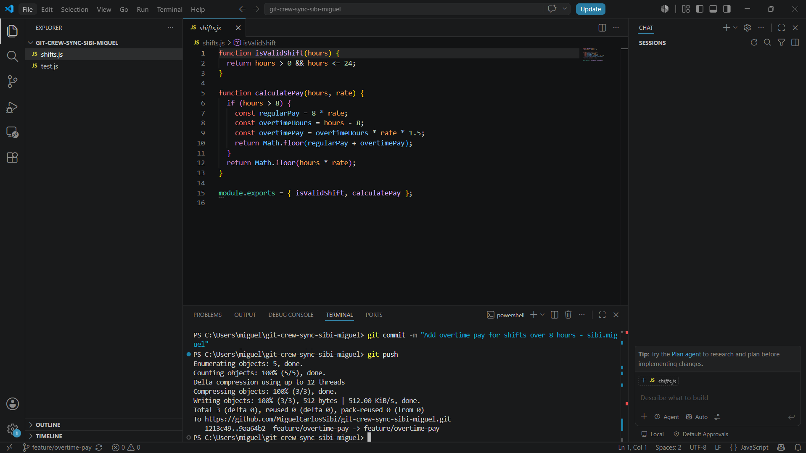
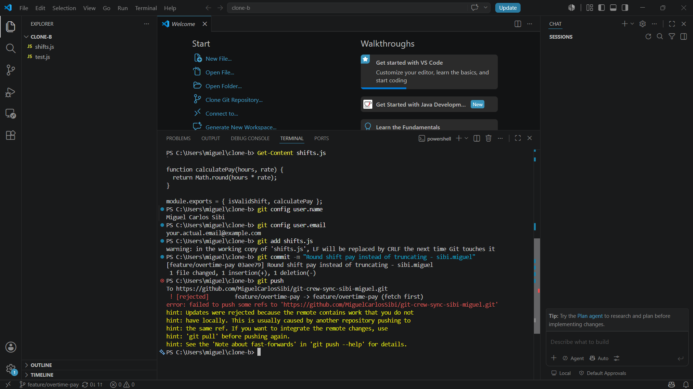
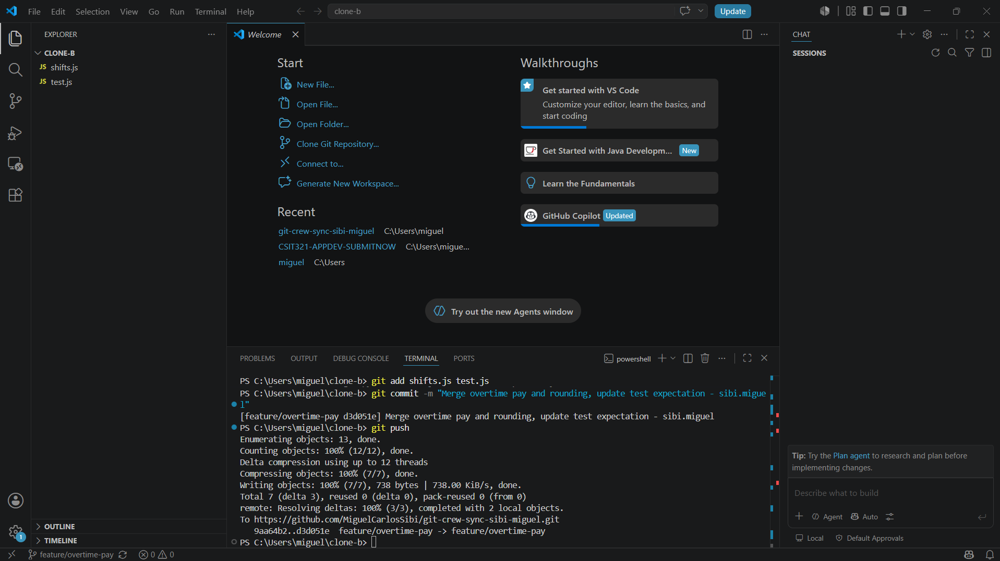
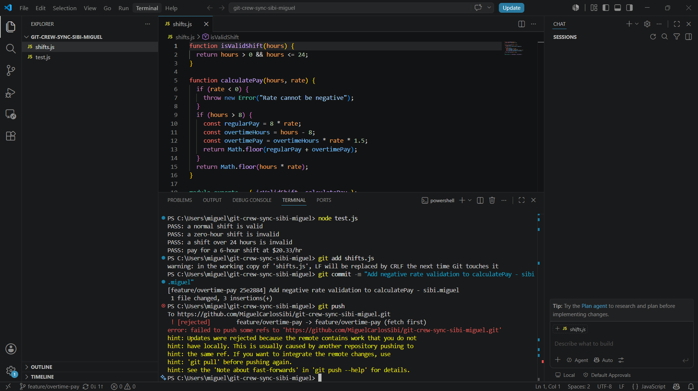
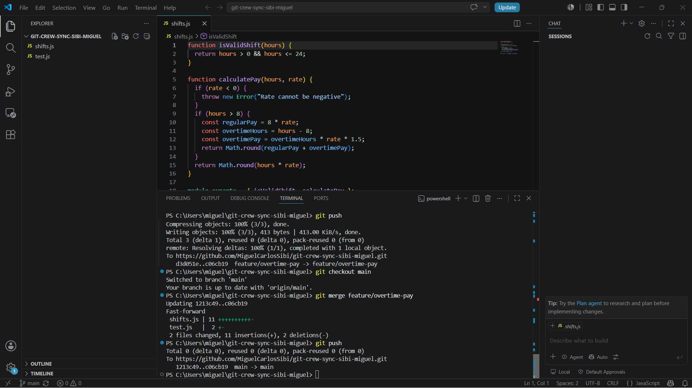
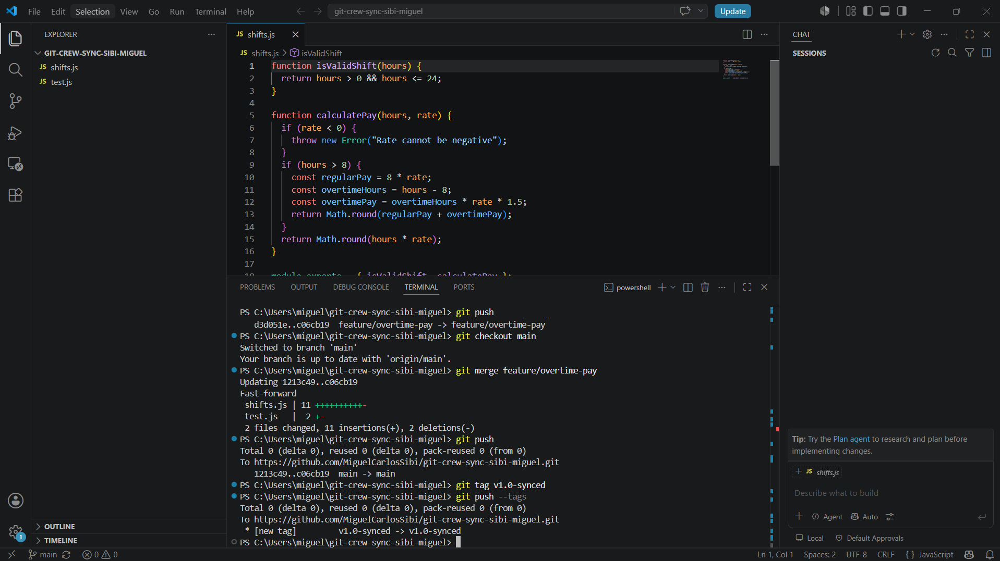
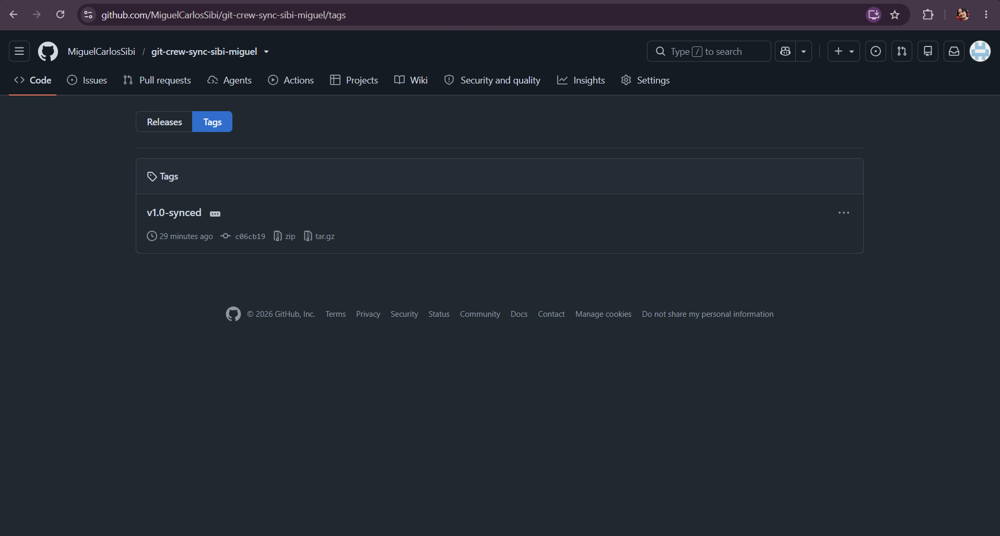

# WORKFLOW.md

## Task Screenshots

### Task 1: Push from Clone A

### Task 2: Rejected push from Clone B

### Task 3: Merge conflict resolved, pushed

### Task 4: Second rejected push, rebase resolved

### Task 5: Main updated and pushed

### Task 6: Tag created and pushed

## Reflection Questions

**1. What did the rejected push error message tell you, and why did it happen?**

The error said `! [rejected] ... (fetch first)` and explained that the remote contained work I did not have locally. This happened because another clone had already pushed commits to the same branch, so my local branch was behind the remote, and git refused a non-fast-forward push so it would not overwrite that work.

**2. What is the actual difference between how you resolved Task 3 (merge) vs Task 4 (rebase)?**

The merge in Task 3 created a new merge commit that ties together two separate histories, keeping both original commits intact with their own timestamps, so the history shows a branch and a join. The rebase in Task 4 rewrote my local commit on top of the fetched remote commit, producing a single linear history with no merge commit, as if I had made my change after already pulling the latest work.

**3. What one habit would have avoided both rejected pushes in this lab?**

Running `git fetch` (or `git pull`) before starting new work on a shared branch, so I would know immediately if someone else had already pushed changes instead of finding out at push time.

**4. Which approach, merge or rebase, would you default to on a shared team branch, and why?**

Merge, because it preserves the true history of when and how changes were integrated, which matters on a shared branch where multiple people might already be pulling. Rebasing already-pushed commits can rewrite history that others rely on. Rebase is safer for cleaning up local, not-yet-shared commits before they are pushed.
